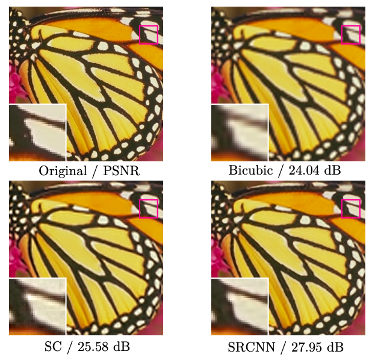
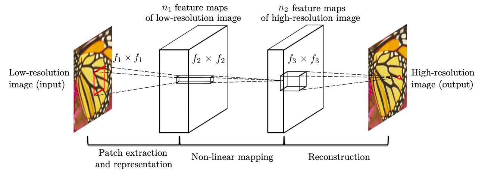
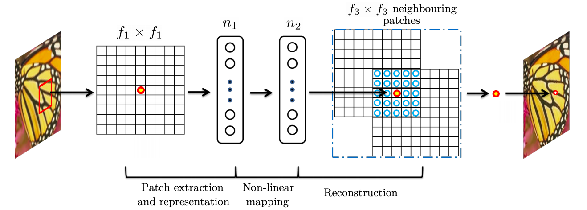
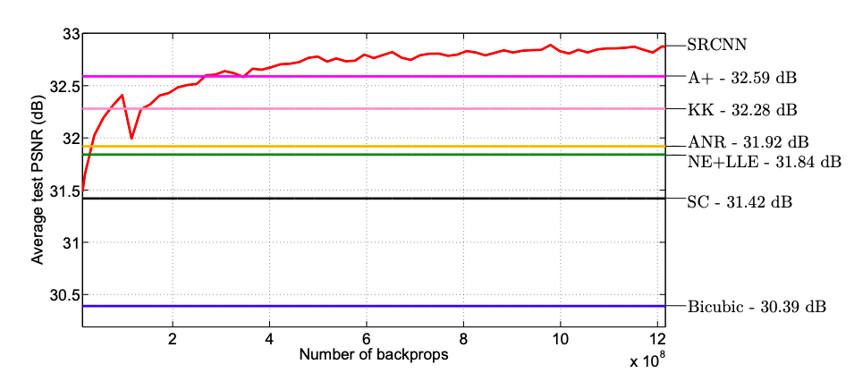

# Image Super-Resolution Using Deep Convolutional Networks

## Paper Info
1. Conference: ECCV
2. Year: 2014

## Summary
   
- Contribution
    1. Learns end-to-end mapping between low and high resolution image using CNN (with mininum pre/post-processing)
    2. Naturally extends the traditional signal processing method to deep learning
    3. SOTA in super resolution task
- Seems like CNN reflects the signal processing theory quite well

## Details
- Why is Super Resolution a hard problem? Because it's ill-posed problem.
 - Traditional Super Resolution
     1. Example-based method: Simply build a dictionary of low resolution image patch and high resolution image patch (PCA, DCT, Haar)
     2. Sparse-coding-based method: Encode a low resolution image to sparse coefficient, and restore with dictionary
 - Method
     1. Patch extraction and representation: extract patch from LR image Y
        - Convolutional filters act as traditional bases
     2. Non-linear mapping: map patch from n1-dimension to n2-dimension
        - Traditionally, applying n2 filters
        - Sparse coding method usually has equal n1, n2. Thus, acts same as 1x1 filter mapping ("pixel-wise fc layer")
     3. Reconstruction: generate HR image from n2-dimension patch
        - Corresponds to averaging overlapping patches and averaging it. This averaging is considered as a pre-defined filter
    
    
 - More details
     - Metric: MSE -> High PSNR (Widely used metric for quantitatively evaluating image restoration quality)
        - MSE: Between central pixels of label and output (Smaller output than label)
        - PSNR: Higher the better(smaller loss)
        - SSIM, IFC, NQM, WPSNR, MSSSIM
     - Dataset: ILSVRC 2013 ImageNet detection training partition (91 images / 395,909 images)
     - Comparison: SC, NE+LLE(neighbour embedding + locally linear embedding), ANR(Anchored Neighbourhood Regression), KK
     
 - Minor details
    - Smaller learning rate in the last layer(10^-5), and bigger learning rate in other layers(10^-4)
    - Synthesize LR images by blurring by Gaussian kernel, sub-sampling it, and upscale it by bicubic interpolation

## References
<https://arxiv.org/pdf/1501.00092.pdf>
